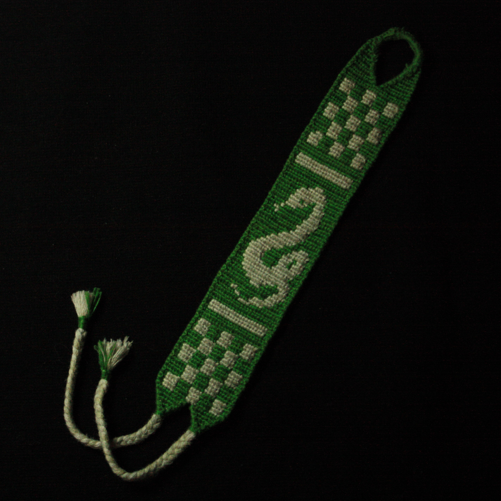
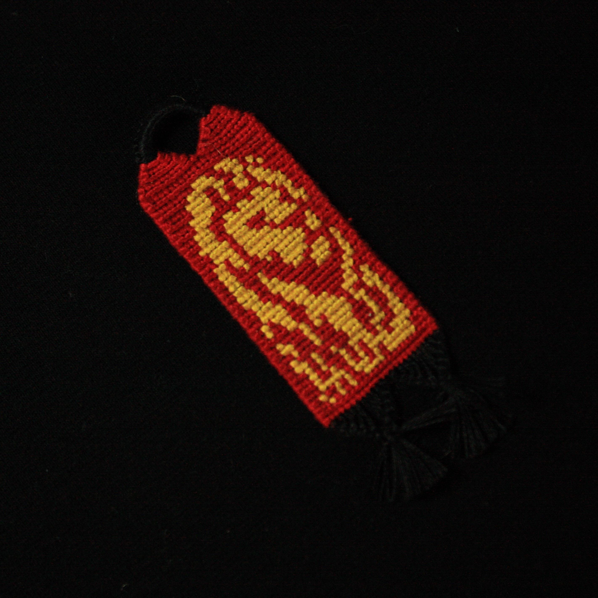
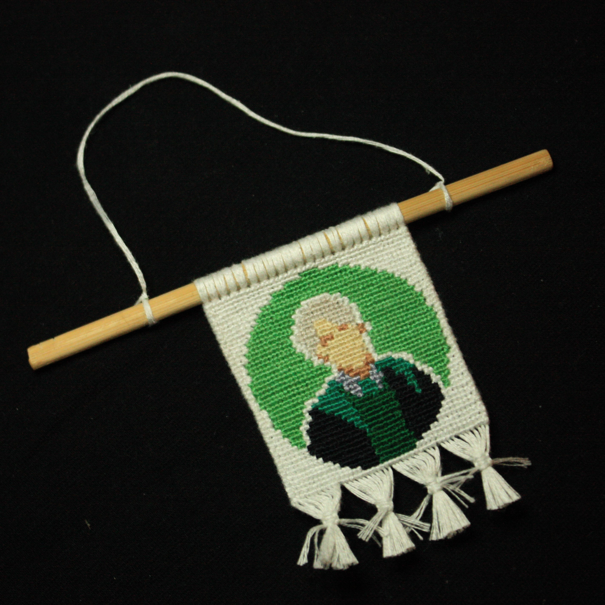

<!DOCTYPE html>
<html lang="en">
<head>
    <meta charset="UTF-8">
    <title>Макраме</title>
    <link rel="stylesheet" href="style.css">
</head>
<body>

 Плетение браслетов макраме

<form>
    

    Макраме́ — техника узелкового плетения. Разновидность прикладного искусства.
    

    

    С помощью техники макраме можно сплести все что угодно - браслет, брелок и даже картину.
    

    
        

    

    Существуют две основные техники плетения - прямое<i>(англ. alfa)</i> и косое<i>(англ. normal)</i>
</form>

    
<form>
    

	 <form action="">
        
 <b>РАЗДЕЛЫ</b>

    </form>
    <form action="main_page.html">
        <button> Главная</button>
    </form>
    <form action="alfa.html">
        <button> Прямое плетение</button>
    </form>
    <form action="normal.html">
        <button> Косое плетение</button>
    </form>
    <form action="materials.html">
        <button> Материалы</button>
    </form>
	<form action="links.html">
        <button> Источники</button>
    </form>
    

</form>

</body>
</html>
